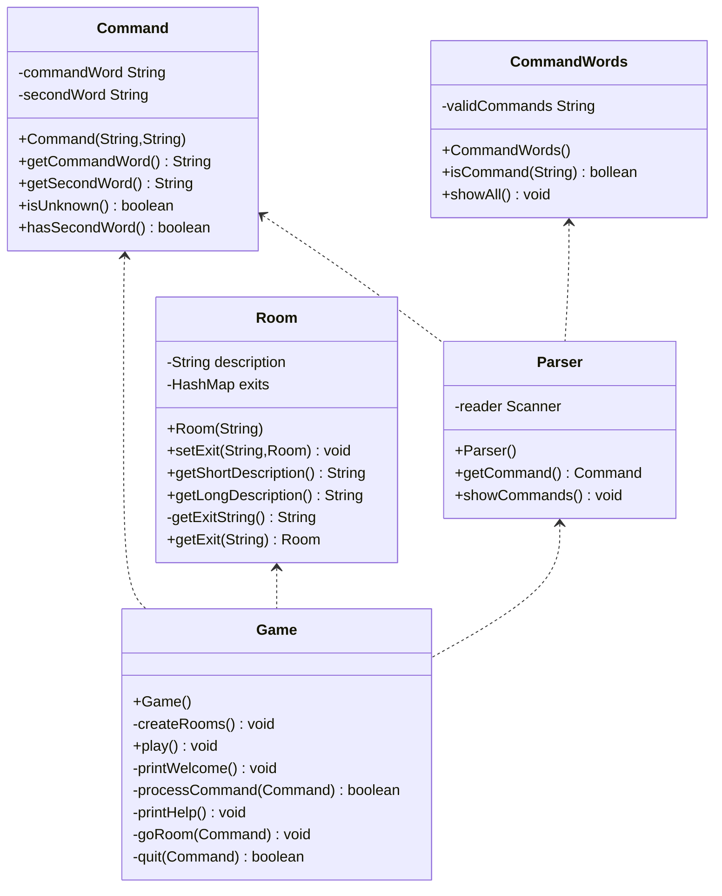

# 实验一报告

#### 队伍：666

#### 班级：软件1804

#### 姓名：杨佳亮

### 1、代码注释及分析

##### Room.java

```java
public class Room
{
    /**
     * Execute the game command entered by the user
     * description Indicates a detailed description of this room
     * exits Store all the exits of the current room, which can lead to another room
     */
    private String description;
    private HashMap<String, Room> exits;

    /**
     * Initialize the room
     * @param description The description of the room, directly stipulated
     */
    public Room(String description)
    {
        this.description = description;
        exits = new HashMap<>();
    }

    /**
     * Add a certain exit to the room, pointing to another room
     * @param direction Direction of exit
     * @param neighbor Adjacent room after passing the exit
     */
    public void setExit(String direction, Room neighbor)
    {
        exits.put(direction, neighbor);
    }

    /**
     * Get a brief description of the room
     * @return The  brief description of the room
     */
    public String getShortDescription()
    {
        return description;
    }

    /**
     * Get a detailed description of the room
     * @return The detailed description of the room
     */
    public String getLongDescription()
    {
        return "You are " + description + ".\n" + getExitString();
    }

    /**
     * Get all the exits of the room
     * @return Strings concatenated in all export directions
     */
    private String getExitString()
    {
        String returnString = "Exits:";
        Set<String> keys = exits.keySet();
        for(String exit : keys) {
            returnString += " " + exit;
        }
        return returnString;
    }

    /**
     * Get a room at an exit of the room
     * @param direction The direction of the exit
     * @return Neighbor room
     */
    public Room getExit(String direction)
    {
        return exits.get(direction);
    }
}
```

##### Main.java

```java
public class Main {
    /**
     * Main game process
     * Create a Game object, execute the play method, and start the game
     */
    public static void main(String[] args) {
        Game game = new Game();
        game.play();
    }
}
```

##### CommandWords.java

```java
public class CommandWords
{
    //Specifies the effective first field set of the command
    private static final String[] validCommands = {
            "go", "quit", "help"
    };

    public CommandWords()
    {
        // nothing to do at the moment...
    }

    /**
     * Get the command string and judge whether it is a legal string
     * @return return returns true if it is a valid string, otherwise it returns false
     */
    public boolean isCommand(String aString)
    {
        for(int i = 0; i < validCommands.length; i++) {
            if(validCommands[i].equals(aString))
                return true;
        }
        return false;
    }

    //Output all valid commands
    public void showAll()
    {
        for(String command: validCommands) {
            System.out.print(command + "  ");
        }
        System.out.println();
    }
}
```

##### Command.java

```java
public class Command
{
    /**
     * Instruction information
     */
    private String commandWord;
    private String secondWord;

    //Instruction constructor
    public Command(String firstWord, String secondWord)
    {
        commandWord = firstWord;
        this.secondWord = secondWord;
    }

    /**
     * Get the first field of the command
     * @returnGet the first field of the command
     */
    public String getCommandWord()
    {
        return commandWord;
    }

    /**
     * Get the second field of the command
     * @return the second field of the command
     */
    public String getSecondWord()
    {
        return secondWord;
    }

    /**
     * Determine whether the first field of the command is empty
     * @return  Return true if it is empty, otherwise return false
     */
    public boolean isUnknown()
    {
        return (commandWord == null);
    }

    /**
     * Determine whether the second field of the command is empty
     * @return  Return true if it is empty, otherwise return false
     */
    public boolean hasSecondWord()
    {
        return (secondWord != null);
    }
}
```

### 2、UML类图及分析



工程中有五个类：Parser、CommandWorld、Comand、Room、Game。

通过阅读源代码，我查看了每个类的方法及相关功能，下面总结一下各个类的用途：

- Commandworld：该类通过存储一个命令词汇字符串数组来定义游戏中所有有效的命令
- Parser：语法分析器从终端读入一行输人，将其解析为命令，并据此创建Command类的对象。
- Command：一个Command对象代表了用户输入的命令，它有一些方法可以很容易地判断是否是有效的命令，还可以将命令中的第一个和第二个单词分离出来。
- Room：一个Room对象代表游戏中的一个位置。房间可以由出口通到其他房间。
- Game：该类是游戏的主类。它启动游戏，然后进入一个不断读取和执行输入的命令的循环。它也包括执行每一个用户命令的代码。

### 3、代码优化

#### 3.1 添加功能look

当我们试玩游戏的时候，很容易发现在一个房间里输入了一系列命令后，先前输出的描述早就不再当前屏幕上了，而我们又记不住房间的出口在哪里，那么look功能就还有用了。

首先可以在记录已知命令字的Commandwords类的validcommands数组中增加一个新的命令字，如下面代码所示。

```java
private static final String[] validCommands = {
            "go", "quit", "help","look"
    };
```

在做了这样的修改之后，就已经可以测试了。然而，当运行游戏，输人命令look的时候，什么也没发生。这与程序不能识别的命令的表现也不一样。如果输入了程序不识别的命令，会看到这样的回答: I don' t know what you mean...

因此，没看到上面的回答说明这个命令字是被认出来了，但是因为还没有为其实现动作编写代码,所以没看到任何回答，通过给Game类增加look命令处理方法来解决这个问题。

```java
private void look()
    {
        System.out.println(currentRoom.getLongDescription());
    }
```

然后，就只需要在processCommand方法中增加一个对look命令字的case分支，当look命令被识别出来后执行look方法就可以了。


#### 3.2 添加功能back

针对上一个新添功能look，当我们知道位置后需要返回时，我们很难记住之前一系列命令的逆序，所以back功能十分有必要。输入back命令就把玩家带回上一个的房间。

首先可以在记录已知命令字的Commandwords类的validcommands数组中增加一个新的命令字，如下面代码所示。

```java
private static final String[] validCommands = {
            "go", "quit", "help","look","back"
    };
```

然后在Game.java中进行相关代码修改。

```java
 private boolean processCommand(Command command)
    {
        boolean wantToQuit = false;

        if(command.isUnknown()) {
            System.out.println("I don't know what you mean...");
            return false;
        }

        String commandWord = command.getCommandWord();
        if (commandWord.equals("help")) {
            printHelp();
        }
        else if (commandWord.equals("go")) {
            goRoom(command);
        }
        else if(commandWord.equals("look")){
            look();
        }
        //增加back指令识别对应的操作
        else if(commandWord.equals("back")){
            if(lastRoom==null) {
        		System.out.println("you are in the first room");
        	}else {
        		currentRoom = lastRoom;
        		System.out.println(currentRoom.getLongDescription());
        	}
        }
        else if (commandWord.equals("quit")) {
            wantToQuit = quit(command);
        }
        // else command not recognised.
        return wantToQuit;
    }
```


#### 3.3 if语句修改

在Game类的processCommand()方法中，当用户输入的命令被辨认出来以后，有一系列的if语句用来分派程序到不同的地方去执行。从面向对象的设计原则来看，这种解决方案不太好，因为每当要加入一个新的命令时，就得在这一堆if语句中再加入一个if分支，最终会导致这个方法的代码膨胀得极其臃肿。于是采用switch-case语句，使得命令的处理更模块化，且新命令的加入能更轻松。

```java
String commandWord = command.getCommandWord();
switch(commandWord){
        case "help":
            printHelp();
            break;
        case "go":
            goRoom(command);
            break;
        case "look":
            look();
            break;
        case "back":
            if(lastRoom==null) {
                System.out.println("you are in the first room");
            }else {
                currentRoom = lastRoom;
                System.out.println(currentRoom.getLongDescription());
            }
            break;
        case "quit":
            wantToQuit = quit(command);
            break;
        }
```

